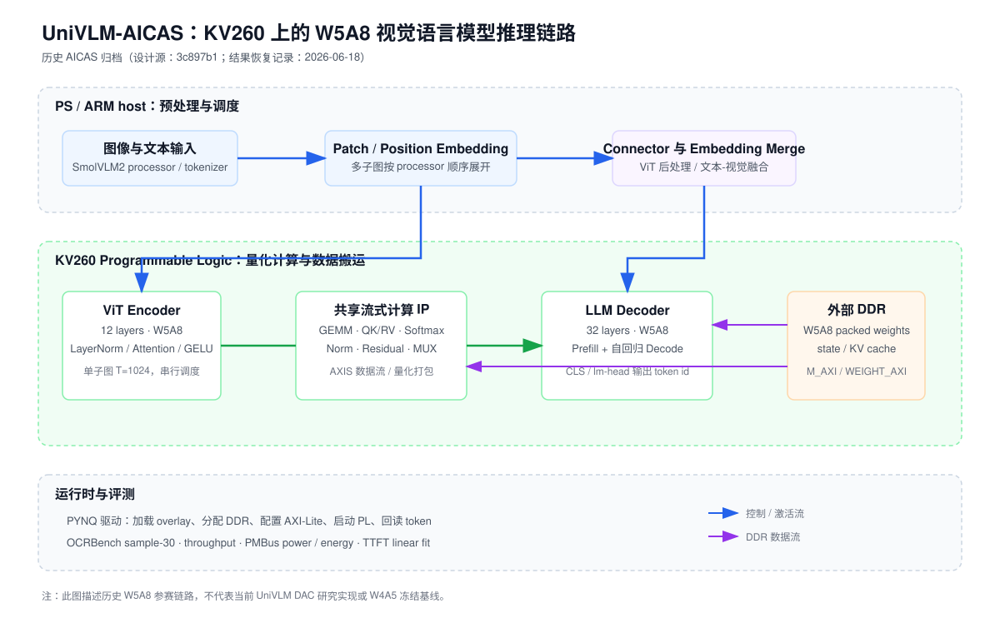
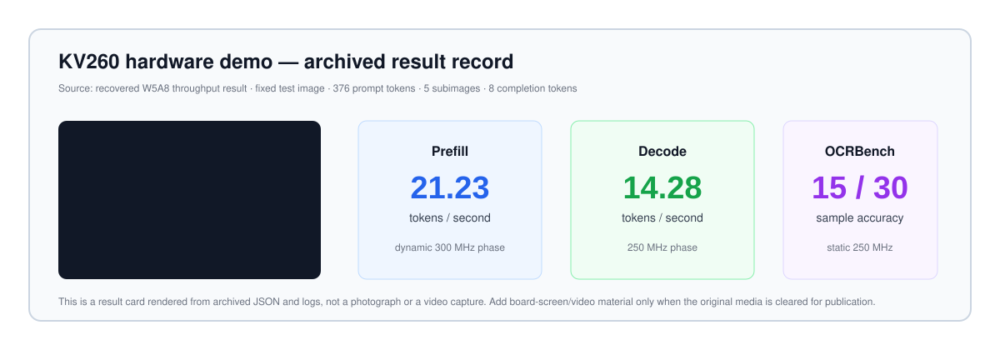

# UniVLM-AICAS

[English](#english) | [中文](#中文)

> A public, presentation-oriented archive of the UniVLM submission for the **AICAS 2026 Grand Challenge**. It preserves the recovered and re-verified **KV260 / W5A8** result set; it is not the active UniVLM-DAC research repository.



## 中文

### 项目简介

UniVLM-AICAS 是一个面向 AMD Kria KV260 的端侧视觉语言模型（VLM）推理原型。系统以 SmolVLM2-500M-Video-Instruct 为模型基础，在 ARM PS 与 FPGA PL 之间划分视觉预处理、量化推理、外部 DDR 数据搬运和自回归解码。该仓库将 AICAS 历史参赛版本整理成便于阅读、演示和引用的公开快照。

本仓库只展示已核验的 W5A8 历史结果。当前的 W4A5 KV260 基线与 DAC 后续研究位于另一个非展示开发仓库，不能将其结果与下表混用。

### 关键结果

| 指标 | 归档复现结果 | 测试口径 |
| --- | ---: | --- |
| OCRBench accuracy | **15 / 30 (50.0%)** | sample-30，静态 250 MHz，`max_image_splits=5` |
| Prefill throughput | **21.23 tok/s** | dynamic prepare/prefill 300 MHz，376 prompt tokens，5 subimages |
| Decode throughput | **14.28 tok/s** | decode 250 MHz，8 completion tokens |
| Energy efficiency | **1.4954 tok/J** | 静态 250 MHz，643 completion tokens，100 Hz PMBus sampling |
| Average power | **5.08 W** | 与上述能耗运行一致 |
| TTFT | **1.647 ms/char + 14952 ms** | 静态 250 MHz，2 images × 3 prompts，warmup + 2 repeats median |
| Timing closure | **WNS +0.096 ns @ 250 MHz** | Vivado 2024.2 post-route |



结果卡片依据归档 JSON 与复现日志生成；它不是板端实拍截图。原始可公开视频/屏幕截图尚未归档到本机，见 [Demo 素材说明](docs/demo-media.md)。

### 架构与方法

- PS 端负责 Hugging Face processor/tokenizer、patch/position embedding、ViT 最终后处理、Connector，以及图像/文本 embedding 合并。
- PL 端以 W5A8 packed weights 执行 ViT encoder、LLM prefill 和逐 token decode；外部 DDR 保存权重、state 和 KV cache。
- PYNQ 驱动加载 overlay、分配 DDR buffer、配置 AXI-Lite 寄存器，并以多子图顺序串行调度 ViT 后进入 LLM。
- 评测覆盖 OCRBench sample-30、吞吐率、板载 PMBus 能耗采样和 TTFT 拟合。完整条件和不可比边界见 [方法说明](docs/method.md)。

### 公开内容与边界

本仓库有意只包含可展示的代码和小型结果摘要：演示入口、指标自检脚本、架构/方法文档与结果记录。为保证资产配对并避免分发模型和平台受限内容，**不包含** W5A8 权重、packed bin、bitstream/overlay、Vivado 工程、OCRBench 图像/标注、板端镜像或完整恢复包。

| 内容 | 是否公开 | 说明 |
| --- | --- | --- |
| 展示文档、图表、结果摘要 | 是 | 本仓库直接提供 |
| PYNQ demo 入口 | 是 | 见 `code/demo.py`；依赖私有部署运行时 |
| 结果完整性检查工具 | 是 | 见 `scripts/check_archived_results.py` |
| 模型/量化权重、bitstream、bin | 否 | 不作为公开发布物；必须使用匹配 manifest 的受控资产 |
| OCRBench 数据和原始评测工具包 | 否 | 由其各自发布方获取并遵守其许可 |

### 快速开始

本展示仓库无需 FPGA 即可检查归档指标：

```bash
git clone https://github.com/songqiangxu/UniVLM-AICAS.git
cd UniVLM-AICAS
python3 scripts/check_archived_results.py
```

预期输出为 `PASS: archived W5A8 metrics match the public record.`。

若你拥有已授权且与 manifest 相匹配的 KV260 部署资产，可将 `code/demo.py` 作为 PYNQ demo 启动入口的参考。它并非独立可运行包：需要匹配的 overlay、权重、PYNQ 运行时、`local_inference` 模块和 KV260 板卡。部署边界与命令见 [运行说明](docs/run-on-kv260.md)。

### 项目结构

```text
.
├── assets/     # 架构图、从归档结果生成的 Demo 结果卡片与输入示例
├── code/       # 公开的 PYNQ demo 入口
├── docs/       # 方法、溯源、运行与 Demo 素材说明
├── results/    # 可公开的、精简后的已验证指标记录
└── scripts/    # 不依赖硬件的结果自检工具
```

### 溯源与论文信息

- 设计源 commit：`3c897b1`（`backup-20260606-dynamic-fclk-runtime`）。
- 公开归档锚点：`w5a8-submission-recovered-20260618`；恢复包记录 commit `eac38c8`。
- overlay 由设计源使用 Vivado 2024.2 重建；accepted bit MD5 前缀为 `d96ccd77`，HWH MD5 前缀为 `89b24f21`。拒绝的 `weight_fifo_merged` overlay（MD5 `8a0bf06c`）与权重布局不匹配，严禁复用。
- 模型：[SmolVLM2-500M-Video-Instruct](https://huggingface.co/HuggingFaceTB/SmolVLM2-500M-Video-Instruct)。
- 赛事：AICAS 2026 Grand Challenge Hardware（KV260）。本项目成果对应参赛系统归档；目前没有可公开链接的同行评审论文。若后续论文发布，请在 [论文信息](docs/paper.md) 中补充正式题目、作者、会议与 DOI/arXiv 链接。

详细证据链、指标口径和排除项见 [Provenance](docs/provenance.md)。

## English

UniVLM-AICAS is a public showcase archive of a KV260 FPGA-assisted SmolVLM2-500M inference system submitted to the AICAS 2026 hardware challenge. The archived W5A8 record reproduces 15/30 OCRBench sample accuracy, 21.23 tok/s prefill, 14.28 tok/s decode, 1.4954 tok/J, and a 1.647 ms/character + 14.952 s TTFT fit under the documented test conditions.

This is deliberately **not** a turnkey deployment repository. It excludes weights, bitstreams, packed binaries, board images, datasets, and proprietary/controlled deployment assets. See the Chinese sections and `docs/` for architecture, method, provenance, and KV260 deployment boundaries.
