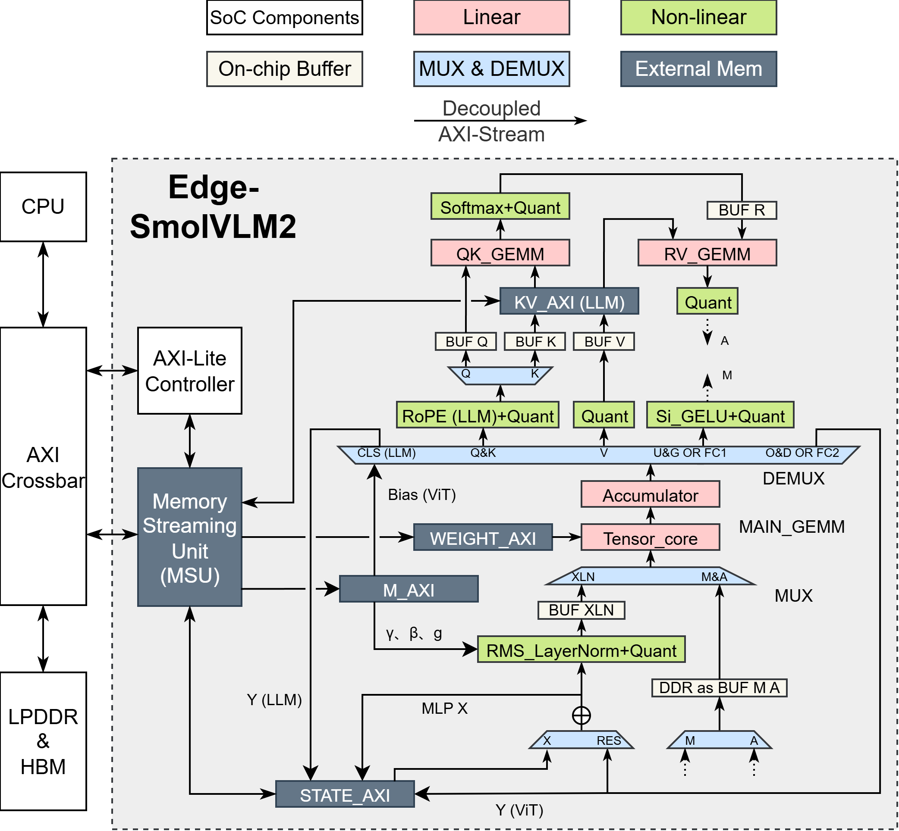
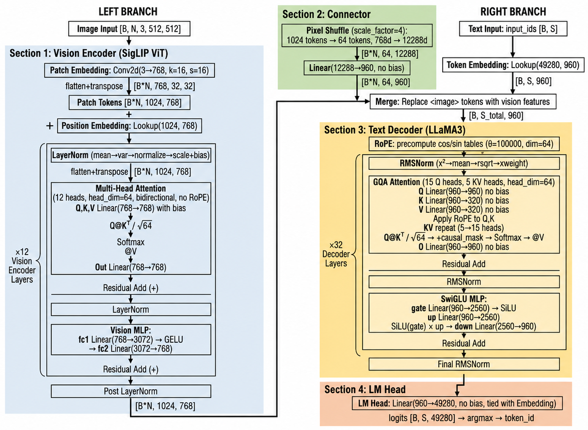
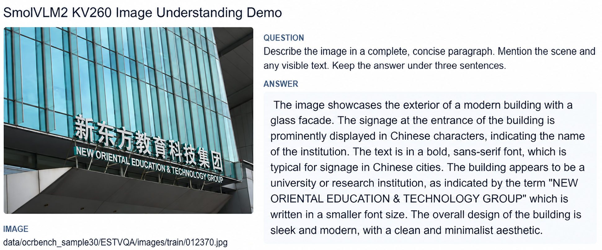

# UniVLM-AICAS

[English](#english) | [中文](#中文)

> Unified ViT--LLM acceleration for efficient end-to-end VLM inference on AMD Kria KV260 FPGA.

## 中文

UniVLM-AICAS 是面向 AMD Kria KV260 的端侧视觉语言模型（VLM）加速器。系统基于 SmolVLM2-500M-Video-Instruct，在 ARM PS 与 FPGA PL 间协同执行视觉预处理、量化推理、DDR 数据搬运和自回归解码。

### 加速器架构



加速器以 AXI Crossbar、Memory Streaming Unit 和 AXI-Lite Controller 连接 CPU、LPDDR/HBM 与计算单元。共享的 Tensor Core、Accumulator、MUX/DEMUX、Attention、Norm、Quantization 与 KV Cache 数据通路支持 ViT 编码和 LLM 解码。

### 模型推理流程



图像经 SigLIP ViT 编码后通过 Connector 映射到语言模型的 hidden size，再与文本 token embedding 融合；LLaMA3 Decoder 生成 token，LM Head 输出最终文本。

### Demo



`hardware/pynq/core/demo.py` 提供单图描述 Demo 入口，并将生成文本、Prefill、Decode 和总耗时写入 JSON。

本仓库公开UniVLM的HLS、SpinalHDL、Vivado及PYNQ核心源代码和已验证实验结果。完整板端复现还需要对应KV260 overlay、量化权重及SmolVLM2模型文件；受文件体积和模型许可限制，部分运行资产未包含在仓库中。

### 关键结果

| 指标 | 结果 | 测试配置 |
| --- | ---: | --- |
| OCRBench accuracy | **15 / 30 (50.0%)** | sample-30，`max_image_splits=5` |
| Prefill throughput | **21.19 tok/s** | 250 MHz，376 prompt tokens，5 subimages |
| Decode throughput | **14.31 tok/s** | 250 MHz，8 completion tokens |
| Energy efficiency | **1.5715 tok/J** | 300 MHz prefill / 250 MHz decode，643 completion tokens，100 Hz PMBus sampling |
| Average power | **5.21 W** | Energy run |
| TTFT | **1.661 ms/char + 13282.6 ms** | 300 MHz prefill / 250 MHz decode，2 images |
| Timing closure | **WNS +0.096 ns @ 250 MHz** | Vivado 2024.2 post-route |

### 论文信息

**UniVLM: Unified ViT--LLM Accelerator for Efficient End-to-End VLM Inference on FPGA**

详见 [论文信息](docs/paper.md)。

### 项目结构

```text
.
├── assets/     # 架构图、推理流程图与 Demo 截图
├── docs/       # 方法、部署和论文信息
├── hardware/   # HLS、SpinalHDL、Vivado 与 PYNQ 源码
├── results/    # 性能结果
└── scripts/    # 结果检查脚本
```

## English

UniVLM-AICAS is an FPGA accelerator for end-to-end visual language model inference on AMD Kria KV260. Built around SmolVLM2-500M-Video-Instruct, it co-designs the ARM processing system and programmable logic for vision encoding, multimodal embedding fusion, LLM prefill, and autoregressive decoding.

The repository includes HLS, SpinalHDL, Vivado, and PYNQ source code together with the AICAS evaluation results and demonstration material.

**Paper:** *UniVLM: Unified ViT--LLM Accelerator for Efficient End-to-End VLM Inference on FPGA*.
